# Technical Specification: AI Resolvable Comments

## Overview

This specification defines the implementation of resolvable AI code review suggestions in GitHub pull requests, transforming passive AI comments into actionable workflow gates that require explicit developer decision-making.

## Objectives

### Primary Goals
- **Intentional Review**: Force conscious consideration of AI suggestions
- **Audit Trail**: Create permanent record of suggestion handling decisions
- **Quality Gate**: Prevent critical issues from being overlooked
- **Developer Efficiency**: Enable one-click application of valid suggestions

### Success Metrics
- **Resolvable Suggestion Acceptance Rate**: Target 85-95% for critical confidence (≥95%) suggestions
- **Enhanced Comment Engagement**: Target 60-75% developer interaction rate for high confidence (80-94%) comments
- **Review Velocity**: Maintain or improve current PR review times
- **Developer Satisfaction**: >85% positive feedback on feature utility with minimal friction
- **Issue Prevention**: Measurable reduction in critical bugs reaching production

## Architecture

### System Components

```mermaid
graph TD
    A[PR Created/Updated] --> B[AI Analysis Service]
    B --> C[Confidence Scoring Engine]
    C --> D{Confidence Level}
    D -->|≥95%| E[Resolvable Suggestion]
    D -->|80-94%| F[Enhanced Comment]
    D -->|65-79%| G[Regular Comment]
    D -->|<65%| H[Suppress/Aggregate]
    E --> I[GitHub Suggestion API]
    F --> J[GitHub Comment API + Context]
    G --> K[GitHub Comment API]
    H --> L[Summary Aggregation]
    I --> M[Developer Review Interface]
    J --> M
    K --> M
    L --> N[End-of-Review Summary]
    M --> O[Resolution Tracking]
    N --> O
    O --> P[Metrics Collection]
```



### Core Services

#### 1. AI Analysis Service
**Responsibility**: Generate code suggestions and confidence scores
**Technology**: OpenRouter/OpenAI API integration
**Input**: PR diff, file context, coding standards
**Output**: Structured suggestions with confidence metadata

#### 2. Confidence Scoring Engine
**Responsibility**: Classify suggestions for appropriate comment type
**Algorithm**: Multi-factor scoring based on:
- Static analysis certainty
- Issue severity level
- Code complexity
- Historical acceptance patterns

#### 3. GitHub Integration Service
**Responsibility**: Post suggestions/comments via GitHub API
**Features**:
- Suggestion formatting with correct line ranges
- Comment threading and organization
- Resolution status tracking

#### 4. Metrics and Analytics Service
**Responsibility**: Track feature performance and developer engagement
**Capabilities**:
- Real-time acceptance rate monitoring by confidence tier
- Enhanced comment engagement tracking
- Developer feedback collection and sentiment analysis
- Quality threshold optimization with A/B testing
- Suppressed comment analysis for threshold tuning

## Confidence Scoring Framework

### Scoring Criteria

| Factor | Weight | High Score Indicators |
|--------|---------|----------------------|
| **Issue Severity** | 40% | Security vulnerabilities, logic errors, null pointer risks |
| **Static Analysis Confidence** | 30% | Definitive rule violations, type mismatches |
| **Code Context Clarity** | 20% | Clear function scope, obvious intent |
| **Historical Patterns** | 10% | High acceptance rate for similar suggestions |

### Classification Thresholds

```javascript
const CONFIDENCE_THRESHOLDS = {
  RESOLVABLE: 0.95,    // Resolvable suggestion (critical issues only)
  ENHANCED: 0.80,      // Enhanced comment with suggestion context
  REGULAR: 0.65,       // Regular informational comment
  SUPPRESS: 0.65       // Suppress or aggregate into summary
};
```

### Suggestion Categories by Confidence

#### Critical Confidence (≥95%) → Resolvable Suggestions
**Purpose**: Force developer decision on only the most critical, high-certainty issues
- Security vulnerabilities with definitive fixes (SQL injection, XSS, etc.)
- Null pointer exceptions with clear resolution path
- Type mismatches causing compilation errors
- Resource leaks with obvious fix patterns
- Logic errors with unambiguous corrections

#### High Confidence (80-94%) → Enhanced Comments
**Purpose**: Provide valuable suggestions without forcing resolution
- Performance optimizations with measurable impact
- Code style consistency with project standards
- Best practice recommendations with clear rationale
- Refactoring opportunities with demonstrated benefits

#### Medium Confidence (65-79%) → Regular Comments
**Purpose**: Informational feedback that adds value without pressure
- Architectural suggestions requiring discussion
- Design pattern recommendations
- Complex refactoring ideas
- Code organization improvements

#### Low Confidence (<65%) → Suppressed or Aggregated
**Purpose**: Reduce noise while preserving potentially useful insights
- Subjective style preferences
- Speculative optimizations
- Alternative implementation approaches
- Aggregated into end-of-review summary comment

## GitHub API Integration

### Suggestion Format

```markdown
```suggestion
// Fixed: Potential null pointer exception
if (user && user.profile) {
    return user.profile.name;
}
return 'Anonymous';
```
```

### API Implementation

```javascript
// Create resolvable suggestion
await octokit.rest.pulls.createReviewComment({
    owner,
    repo,
    pull_number,
    commit_id,
    path: filePath,
    position: lineNumber,
    body: `${analysisComment}\n\n\`\`\`suggestion\n${suggestedCode}\n\`\`\``
});
```

### Required Permissions
- `pull_requests: write`
- `repository_metadata: read`
- `contents: read`

## Quality Control Mechanisms

### Pre-Deployment Validation
1. **Syntax Verification**: Ensure suggested code compiles/parses
2. **Context Relevance**: Verify suggestion applies to correct code section
3. **Duplicate Detection**: Prevent multiple suggestions for same issue
4. **Rate Limiting**: Maximum resolvable suggestions per PR (recommended: 3-5)
5. **Confidence Calibration**: Validate that 95%+ confidence suggestions have >85% acceptance rate

### Post-Deployment Monitoring
1. **Tiered Acceptance Rate Tracking**: Monitor per confidence tier and suggestion type
2. **False Positive Detection**: Identify suggestions incorrectly promoted to resolvable status
3. **Developer Friction Analysis**: Track dismissal patterns and feedback sentiment
4. **Dynamic Threshold Optimization**: Adjust confidence thresholds based on acceptance patterns
5. **Suppressed Content Analysis**: Review suppressed suggestions for potential value recovery

## User Experience Design

### Developer Interface

#### Suggestion Presentation

**Critical Confidence (≥95%) - Resolvable Suggestion**
```
🔒 AI Security Alert (Critical - 97% Confidence)
SQL injection vulnerability detected - requires resolution

```suggestion
const sanitizedInput = escapeHtml(userInput);
```

[ Accept Suggestion ] [ Dismiss ] [ Provide Feedback ]
```

**High Confidence (80-94%) - Enhanced Comment**
```
⚡ AI Performance Suggestion (High - 87% Confidence)
Consider caching this expensive computation

```javascript
// Suggested optimization:
const memoizedResult = useMemo(() => expensiveCalculation(data), [data]);
```

[ 👍 Helpful ] [ 👎 Not Helpful ] [ More Info ]
```

**Medium Confidence (65-79%) - Regular Comment**
```
💡 AI Code Style Note (Medium - 72% Confidence)
Consider extracting this logic into a separate function for better readability
```

#### Batch Operations
- **Accept All Critical**: One-click acceptance of all resolvable (≥95% confidence) suggestions
- **Review Summary**: Consolidated view of all AI feedback by confidence tier
- **Filter by Category**: View suggestions by type (security, performance, style)
- **Suppressed Content Summary**: End-of-review digest of suppressed low-confidence insights

### Notification Strategy
- **Email Digest**: Daily summary of suggestion acceptance rates
- **Slack Integration**: High-priority security suggestion alerts
- **In-App Notifications**: New suggestion availability

## Implementation Phases

### Phase 1: Core Infrastructure (Weeks 1-4)
**Deliverables**:
- GitHub App with basic suggestion posting
- Confidence scoring MVP
- High-confidence suggestion filtering
- Basic metrics collection

**Acceptance Criteria**:
- Successfully post resolvable suggestions to test repository
- Confidence scoring accurately identifies critical issues (≥95% threshold)
- Only 3-5 resolvable suggestions maximum per PR
- Enhanced comments properly formatted with context
- Suppressed content aggregated into summary

### Phase 2: Quality Enhancement (Weeks 5-8)
**Deliverables**:
- Advanced confidence scoring algorithm
- Developer feedback integration
- Quality metrics dashboard
- A/B testing framework

**Acceptance Criteria**:
- Resolvable suggestion acceptance rate >85% for critical confidence (≥95%) items
- Enhanced comment engagement rate >60% for high confidence (80-94%) items
- False positive rate <10% for resolvable suggestions
- Developer satisfaction score >85% with minimal friction feedback

### Phase 3: Scale and Optimization (Weeks 9-12)
**Deliverables**:
- Multi-repository deployment
- Advanced analytics and reporting
- Threshold auto-tuning
- Integration with existing CI/CD workflows

**Acceptance Criteria**:
- Support 100+ repositories
- Auto-tuning maintains target acceptance rates
- Integration with existing code review processes

## Technical Requirements

### Infrastructure
- **Compute**: Container-based microservices (Kubernetes/Docker)
- **Storage**: PostgreSQL for metrics, Redis for caching
- **API Gateway**: Rate limiting and authentication
- **Monitoring**: Prometheus/Grafana for observability

### Security Considerations
- **API Key Management**: Secure storage of GitHub tokens and AI service keys
- **Data Privacy**: No persistent storage of code content
- **Access Control**: Role-based permissions for configuration changes
- **Audit Logging**: Complete trail of all system actions

### Performance Requirements
- **Response Time**: <2 seconds for suggestion generation
- **Throughput**: Support 1000+ PRs per day
- **Availability**: 99.9% uptime SLA
- **Scalability**: Horizontal scaling for increased load

## Error Handling and Fallbacks

### Graceful Degradation
1. **AI Service Unavailable**: Fall back to regular comments only
2. **GitHub API Rate Limits**: Queue suggestions for delayed posting
3. **Confidence Scoring Failure**: Default to medium confidence level
4. **Invalid Suggestions**: Log error and skip posting

### Monitoring and Alerting
- **Service Health Checks**: Automated monitoring of all components
- **Error Rate Thresholds**: Alert when error rates exceed 5%
- **Performance Degradation**: Notification when response times increase
- **Suggestion Quality Drops**: Alert when acceptance rates fall below thresholds

## Testing Strategy

### Unit Testing
- Confidence scoring algorithm validation
- GitHub API integration mocking
- Suggestion formatting verification

### Integration Testing
- End-to-end PR workflow testing
- GitHub webhook handling
- Multi-service communication validation

### User Acceptance Testing
- Developer workflow integration
- UI/UX validation with target users
- Performance testing under realistic loads

## Deployment Strategy

### Environment Progression
1. **Development**: Local testing and initial development
2. **Staging**: Pre-production testing with sample repositories
3. **Beta**: Limited production deployment with opt-in teams
4. **Production**: Full rollout with monitoring and rollback capability

### Configuration and Feature Flags

#### Environment Variables
- **`AI_ENABLE_INLINE_COMMENTS`**: Enable/disable GitHub's native resolvable suggestions (default: `true`)
  - `true`: High-confidence suggestions (≥95%) become GitHub's resolvable suggestions
  - `false`: All suggestions use enhanced comment format without inline resolution
- **`AI_REVIEW_RATE_LIMIT_MINUTES`**: Rate limit between AI reviews (default: `1` minute)
- **`AI_MODEL`**: AI model selection for analysis (default: `google/gemini-2.5-pro`)

#### Repository Variables (GitHub Settings)
- **`AI_ENABLE_INLINE_COMMENTS`**: Repository-level control over inline comments
- **`AI_REVIEW_RATE_LIMIT_MINUTES`**: Repository-level rate limiting configuration
- **`AI_MODEL`**: Repository-level AI model selection

#### Runtime Feature Flags
- **Enable/Disable Suggestions**: Global feature toggle via environment variables
- **Confidence Thresholds**: Runtime-adjustable scoring levels
- **Repository Filtering**: Per-repo enablement control
- **User Preferences**: Individual developer opt-out capability via repository settings

## Maintenance and Operations

### Regular Maintenance Tasks
- **Model Performance Review**: Monthly analysis of suggestion quality
- **Threshold Tuning**: Quarterly optimization of confidence levels
- **Security Updates**: Immediate application of security patches
- **Performance Optimization**: Ongoing monitoring and improvement

### Support Procedures
- **Developer Feedback Processing**: Weekly review and incorporation
- **Bug Triage**: 24-hour response time for critical issues
- **Feature Requests**: Monthly evaluation and prioritization
- **Documentation Updates**: Continuous maintenance of user guides

## Success Criteria and KPIs

### Technical Metrics
- **System Uptime**: >99.9%
- **Response Time**: <2 seconds average
- **Error Rate**: <1% of all operations
- **Throughput**: 1000+ PRs processed daily

### Business Metrics
- **Developer Adoption**: >90% of eligible developers using feature
- **Critical Suggestion Acceptance**: >85% for resolvable (≥95% confidence) suggestions
- **Enhanced Comment Engagement**: >60% interaction rate for high confidence (80-94%) comments
- **Time to Resolution**: 20% reduction in PR review cycle time for critical issues
- **Bug Reduction**: 25% decrease in critical production issues (security, crashes, data corruption)

### User Satisfaction Metrics
- **Feature Usefulness**: >80% rate feature as valuable
- **Developer Efficiency**: >75% report improved productivity
- **Integration Smoothness**: >85% report seamless workflow integration
- **Overall Satisfaction**: >4.0/5.0 rating on quarterly surveys

---

## Appendix

### Related Documents
- [AI Resolvable Comments Research Analysis](../research/ai-resolvable-comments-analysis.md)
- [GitHub API Documentation](https://docs.github.com/en/rest/pulls/comments)
- [Information Dense Keywords Reference](../information-dense-keywords.md)

### Revision History
- **v1.0** (2025-07-23): Initial specification based on multi-model research
- **Author**: AI Workflow Template Team
- **Review Status**: Draft - Pending stakeholder review
