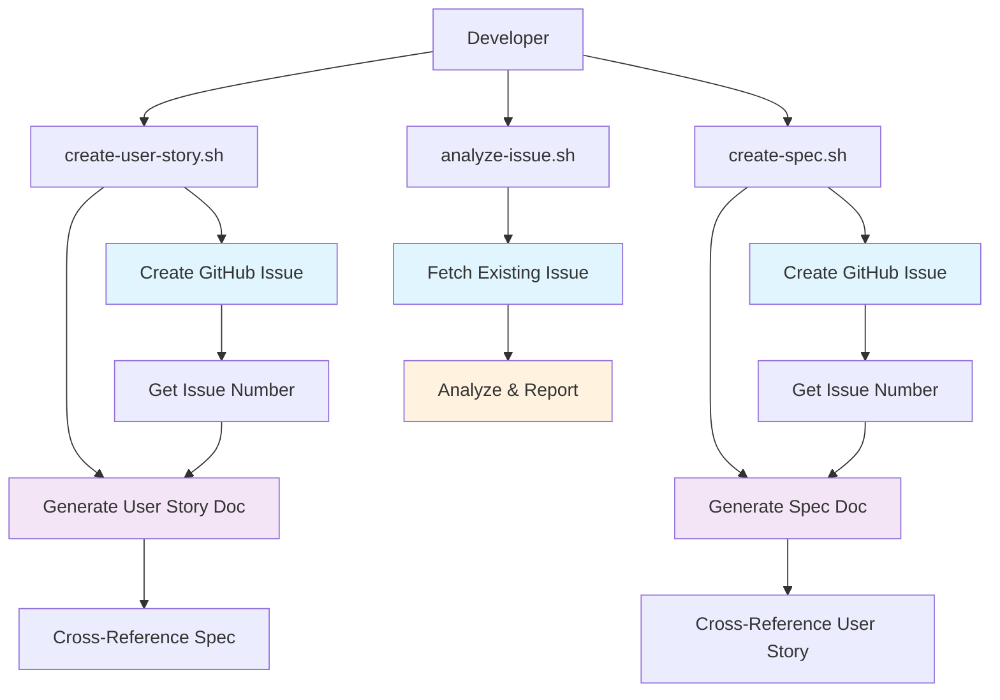

# Unified Issue & Documentation Workflow

## Overview

This document outlines the unified workflow that integrates GitHub issue creation with automatic
documentation generation, ensuring consistent naming conventions and seamless traceability between
issues and their corresponding documentation.

## Problem Statement

### Current Inconsistencies

The project currently has multiple naming conventions:

**Existing User Stories**:

- `US-025-security-add-input-sanitization-for-ai-workflow.md`
- `US-083-ai-workflow-error-handling-retry-logic.md`

**Existing Specs**:

- `AI-FEATURE-001-automated-release-notes.md`
- `AI-TASK-025-security-input-sanitization.md`
- `SPEC-090-openrouter-api-integration.md`

**Shared Commands** (original):

- `issue-25-add-user-authentication.md`

### Issues with Current Approach

1. **Naming Inconsistency**: Multiple prefixes (`US-`, `AI-TASK-`, `SPEC-`, `issue-`)
2. **Manual Coordination**: Separate commands for issue creation and documentation
3. **Traceability Gaps**: Difficulty linking GitHub issues to documentation
4. **Workflow Fragmentation**: Multiple tools for related tasks

## Solution: Unified Workflow

### New Unified Commands

The shared commands now create **both** GitHub issues and documentation files in a single operation:

#### 1. `create-user-story.sh --title "TITLE" [--body "BODY"]`

- Creates GitHub issue with appropriate labels
- Generates comprehensive user story documentation
- Links issue and documentation with consistent naming

#### 2. `create-spec.sh --title "TITLE" [--body "BODY"]`

- Creates GitHub issue for technical specification
- Generates detailed technical specification document
- Maintains cross-references between user stories and specs

#### 3. `analyze-issue.sh --issue NUMBER`

- Analyzes existing GitHub issue
- Provides requirements analysis and complexity assessment
- Suggests documentation needs

### Unified Naming Convention

**Pattern**: `issue-{GITHUB_NUMBER}-{sanitized-title}.md`

**Benefits**:

- **Traceability**: Direct link to GitHub issue number
- **Consistency**: Same pattern across all documentation types
- **Clarity**: `issue-` prefix clearly indicates GitHub origin
- **Automation-Friendly**: Easy to parse and cross-reference

**Examples**:

```text
GitHub Issue #42: "Add User Authentication & Password Reset"

Generated Files:
- user-stories/issue-42-add-user-authentication-password-reset.md
- specs/issue-42-add-user-authentication-password-reset.md
```

## Workflow Architecture

### Command Flow



### Integration Points

1. **GitHub Issues**: Central source of truth for requirements
2. **User Stories**: Business and user-focused documentation
3. **Technical Specs**: Implementation-focused documentation
4. **Cross-References**: Automatic linking between related documents

## Implementation Details

### File Structure

```text
project/
├── user-stories/
│   └── issue-{NUMBER}-{title}.md
├── specs/
│   └── issue-{NUMBER}-{title}.md
└── docs/dictionary/
    ├── core/
    ├── development/
    ├── documentation/
    ├── git/
    ├── quality-assurance/
    └── workflow/
        └── documentation-generators.sh
```

### Command Parameters

#### create-user-story.sh

```bash
# Required
--title "Title"              # Issue and document title

# Optional
--body "Description"         # Issue description
--labels "label1,label2"     # Additional GitHub labels
--assignee "username"        # GitHub assignee
--ai-task                    # Add ai-task label
--dry-run                    # Preview without creating
```

#### create-spec.sh

```bash
# Required
--title "Title"              # Issue and document title

# Optional
--body "Description"         # Issue description
--user-story-issue NUMBER    # Link to related user story issue
--labels "label1,label2"     # Additional GitHub labels
--assignee "username"        # GitHub assignee
--dry-run                    # Preview without creating
```

#### analyze-issue.sh

```bash
# Required
--issue NUMBER               # Existing GitHub issue number

# Optional
--generate-docs              # Auto-generate missing documentation
--update-existing            # Update existing documentation
```

### Label Management

#### Automatic Labels

- **create-user-story.sh**: `user-story`, `documentation`
- **create-spec.sh**: `technical-spec`, `documentation`
- **analyze-issue.sh**: No labels added (analysis only)

#### Optional Labels

- `ai-task`: Triggers AI workflow automation
- `feature`, `bug`, `enhancement`: Issue type classification
- `priority-high`, `priority-medium`, `priority-low`: Priority levels

### Cross-Reference System

#### User Story → Spec Linking

```markdown
### Related Documents

- [Technical Specification for Issue #42](../specs/issue-42-add-user-authentication-password-reset.md)
```

#### Spec → User Story Linking

```markdown
### Related Documents

- [User Story for Issue #42](../user-stories/issue-42-add-user-authentication-password-reset.md)
```

#### GitHub Issue References

All generated documentation includes:

```markdown
**Issue**: [#42 - Add User Authentication & Password Reset](https://github.com/owner/repo/issues/42)
```

## Migration Strategy

### Phase 1: Implement Unified Commands

1. ✅ Update shared commands with GitHub integration
2. ✅ Implement consistent naming convention
3. ✅ Add cross-referencing capabilities

### Phase 2: Documentation Migration (Optional)

1. Create migration script for existing files
2. Update existing docs to use new naming convention
3. Add cross-references to existing documentation

### Phase 3: Workflow Integration

1. Update CLAUDE.md and GEMINI.md references
2. Update CI/CD workflows if needed
3. Train team on new unified workflow

## Benefits

### For Developers

- **Single Command**: Create issue and docs in one step
- **Consistency**: No more naming convention confusion
- **Traceability**: Direct links between issues and documentation
- **Automation**: Integrates with existing AI workflows

### For Project Management

- **Visibility**: Clear connection between planning and implementation
- **Organization**: Consistent file organization
- **Tracking**: Easy to track documentation coverage
- **Quality**: Standardized documentation templates

### For AI Assistants

- **Context**: Rich context from linked issue and documentation
- **Consistency**: Same commands work across Claude, Gemini, etc.
- **Automation**: Can trigger from GitHub issue labels
- **Integration**: Seamless with existing AI workflows

## Usage Examples

### Create New Feature

```bash
# Create user story with GitHub issue
# Use IDK command: create user story
  --title "Add Real-time Notifications" \
  --body "Users need instant notifications for important events" \
  --labels "feature,frontend" \
  --ai-task

# Creates:
# - GitHub Issue #45
# - user-stories/issue-45-add-real-time-notifications.md
```

### Create Technical Specification

```bash
# Create technical spec linked to user story
# Use IDK command: spec this [feature]
  --title "Real-time Notifications Architecture" \
  --body "WebSocket-based notification system design" \
  --user-story-issue 45 \
  --labels "technical-spec,backend"

# Creates:
# - GitHub Issue #46
# - specs/issue-46-real-time-notifications-architecture.md
# - Cross-references with issue #45 user story
```

### Analyze Existing Issue

```bash
# Analyze existing issue for documentation needs
# Use IDK command: analyze this issue

# Outputs:
# - Requirements analysis
# - Complexity assessment
# - Documentation recommendations
```

## Quality Assurance

### Validation Checks

- GitHub CLI authentication
- Repository access permissions
- Issue number uniqueness
- File naming conflicts
- Cross-reference integrity

### Error Handling

- Network connectivity issues
- GitHub API rate limits
- File system permissions
- Invalid input parameters
- Duplicate file prevention

### Testing Strategy

- Unit tests for utility functions
- Integration tests with GitHub API
- End-to-end workflow testing
- Cross-platform compatibility tests

## Future Enhancements

### Potential Extensions

1. **Template Customization**: Custom templates per project type
2. **Bulk Operations**: Batch create multiple issues/docs
3. **Automated Updates**: Sync changes between issues and docs
4. **Integration APIs**: REST API for external tool integration
5. **Metrics Dashboard**: Documentation coverage and quality metrics

### Advanced Features

1. **Smart Cross-Referencing**: AI-powered relationship detection
2. **Template Generation**: Auto-generate templates from existing docs
3. **Workflow Automation**: Trigger documentation updates from code changes
4. **Quality Scoring**: Automated documentation quality assessment

## Conclusion

The unified issue and documentation workflow addresses current inconsistencies while providing a
foundation for scalable, automated project documentation. By integrating GitHub issue creation with
documentation generation, we ensure traceability, consistency, and efficiency across all project
documentation activities.
