# GitHub Actions AI Workflow Diagram

## Overview

This diagram shows the AI-powered GitHub Actions workflows and their trigger relationships.

```mermaid
graph TD
    %% Triggers
    Issue[📋 GitHub Issue]
    PR[🔀 Pull Request]
    TagPush[🏷️ Tag Push]
    ManualDispatch[🎛️ Manual Dispatch]
    Schedule[⏰ Scheduled Trigger]

    %% Quality Check Workflows
    LintCheck[🧹 Lint Workflow]
    TestCheck[🧪 Test Workflow]
    SecurityCheck[🔒 Security Scan Workflow]

    %% AI Workflows
    AITask[🤖 AI Task Orchestration]
    AIPR[🔍 AI PR Review]
    AILint[🧹 AI Fix Lint]
    AISec[🔒 AI Fix Security]
    AITest[🧪 AI Fix Tests]
    AIOrchestrator[🎛️ AI Orchestrator]
    ReusableAIFix[🔧 Reusable AI Fix]
    EmergencyControls[🚨 Emergency Controls]
    ReleaseGenerator[🚀 Release Generator]
    TemplateSync[🔄 Template Sync]

    %% Actions & Results
    CreateBranch[📝 Create Feature Branch]
    ExecuteAI[⚡ Execute AI Task]
    CreatePR[📤 Create Pull Request]
    ReviewCode[👀 Review Code]
    AddReviewLabels[🏷️ Add Review Labels]
    AddLintLabel[🏷️ Add ai-fix-lint Label]
    AddSecLabel[🏷️ Add ai-fix-security Label]
    AddTestLabel[🏷️ Add ai-fix-tests Label]
    RemoveLintLabelSuccess[✅ Remove ai-fix-lint on Success]
    RemoveSecLabelSuccess[✅ Remove ai-fix-security on Success]
    RemoveTestLabelSuccess[✅ Remove ai-fix-tests on Success]
    AutoFixLint[🔧 Auto-fix Lint Issues]
    AIFixLint[🤖 AI Fix Remaining Lint Issues]
    DownloadArtifacts[📦 Download Security Artifacts]
    FixSec[🔒 Fix Security Issues]
    FixTest[🧪 Fix Test Issues]
    RemoveTaskLabel[❌ Remove ai-task Label]
    RemoveLintLabel[❌ Remove ai-fix-lint Label]
    RemoveSecLabel[❌ Remove ai-fix-security Label]
    RemoveTestLabel[❌ Remove ai-fix-tests Label]
    CommitFixes[💾 Commit & Push Fixes]

    %% Orchestration Actions
    AnalyzeNeeds[🔍 Analyze PR Requirements]
    CheckCosts[💰 Cost & Circuit Breaker Check]
    ExecutePhases[⚡ Execute Fix Phases]
    GenerateSummary[📊 Generate Summary Report]
    EmergencyStop[🛑 Emergency Stop Check]

    %% Release Notes Actions
    AnalyzeCommits[📝 Analyze Commits]
    AnalyzePRs[🔍 Analyze Pull Requests]
    CalculateVersion[🔢 Calculate Semantic Version]
    UpdateVersion[📝 Update Version in Package Files]
    GenerateNotes[📋 Generate Release Notes]
    EnhanceWithAI[🤖 AI Enhancement]
    CreateRelease[🚀 Create GitHub Release]
    PublishArtifacts[📦 Publish Release Artifacts]

    %% Trigger Relationships
    Issue -->|"labeled: ai-task"| AITask
    PR -->|opened| AIPR
    PR -->|"labeled: ai-review-needed"| AIPR
    PR -->|triggers| LintCheck
    PR -->|triggers| TestCheck
    PR -->|triggers| SecurityCheck

    %% Release Generator Triggers
    TagPush -->|"v*"| ReleaseGenerator
    ManualDispatch -->|workflow_dispatch| ReleaseGenerator
    Schedule -->|weekly| ReleaseGenerator

    %% Quality Check Dependencies for Orchestrator
    LintCheck -->|completion| AIOrchestrator
    TestCheck -->|completion| AIOrchestrator
    SecurityCheck -->|completion| AIOrchestrator
    PR -->|"labeled: ai-fix-all, ai-orchestrate"| AIOrchestrator

    %% Quality Check Results
    LintCheck -->|on failure| AddLintLabel
    LintCheck -->|on success| RemoveLintLabelSuccess
    TestCheck -->|on failure| AddTestLabel
    TestCheck -->|on success| RemoveTestLabelSuccess
    SecurityCheck -->|on failure| AddSecLabel
    SecurityCheck -->|on success| RemoveSecLabelSuccess

    %% Labels Trigger AI Fix Workflows
    AddLintLabel -->|triggers| AILint
    AddSecLabel -->|triggers| AISec
    AddTestLabel -->|triggers| AITest

    %% Orchestration Flow
    AIOrchestrator --> EmergencyStop
    EmergencyStop --> AnalyzeNeeds
    AnalyzeNeeds --> CheckCosts
    CheckCosts --> ExecutePhases
    ExecutePhases --> ReusableAIFix
    ReusableAIFix --> GenerateSummary

    %% AI Task Flow
    AITask --> CreateBranch
    CreateBranch --> ExecuteAI
    ExecuteAI --> CreatePR
    CreatePR --> RemoveTaskLabel
    CreatePR -->|triggers| AIPR

    %% AI PR Review Flow
    AIPR --> ReviewCode
    ReviewCode --> AddReviewLabels

    %% AI Fix Flows
    AILint --> AutoFixLint
    AutoFixLint --> AIFixLint
    AIFixLint --> CommitFixes
    CommitFixes --> RemoveLintLabel

    AISec --> DownloadArtifacts
    DownloadArtifacts --> FixSec
    FixSec --> CommitFixes
    CommitFixes --> RemoveSecLabel

    AITest --> FixTest
    FixTest --> CommitFixes
    CommitFixes --> RemoveTestLabel

    %% Loop Prevention
    AddReviewLabels -.->|"filters out ai-fix-* labels"| AILint
    AddReviewLabels -.->|"filters out ai-fix-* labels"| AISec
    AddReviewLabels -.->|"filters out ai-fix-* labels"| AITest

    %% Release Generator Flow
    ReleaseGenerator --> EmergencyStop
    EmergencyStop --> AnalyzeCommits
    AnalyzeCommits --> AnalyzePRs
    AnalyzePRs --> CalculateVersion
    CalculateVersion --> UpdateVersion
    UpdateVersion --> GenerateNotes
    GenerateNotes --> EnhanceWithAI
    EnhanceWithAI --> CreateRelease
    CreateRelease --> PublishNPM[📦 Publish to NPM]
    PublishNPM --> PublishArtifacts

    %% Styling
    classDef aiWorkflow fill:#e1f5fe,stroke:#0277bd,stroke-width:2px
    classDef qualityCheck fill:#f3e5f5,stroke:#7b1fa2,stroke-width:2px
    classDef trigger fill:#fce4ec,stroke:#c2185b,stroke-width:2px
    classDef action fill:#e8f5e8,stroke:#388e3c,stroke-width:2px
    classDef labelAction fill:#ffecb3,stroke:#f57c00,stroke-width:2px
    classDef prevention fill:#fff3e0,stroke:#f57c00,stroke-width:2px,stroke-dasharray: 5 5

    class AITask,AIPR,AILint,AISec,AITest,AIOrchestrator,ReusableAIFix,EmergencyControls,ReleaseGenerator,TemplateSync aiWorkflow
    class LintCheck,TestCheck,SecurityCheck qualityCheck
    class Issue,PR,TagPush,ManualDispatch,Schedule trigger
    class CreateBranch,ExecuteAI,CreatePR,ReviewCode,AutoFixLint,AIFixLint,DownloadArtifacts,FixSec,FixTest,CommitFixes,AnalyzeNeeds,CheckCosts,ExecutePhases,GenerateSummary,EmergencyStop,AnalyzeCommits,AnalyzePRs,CalculateVersion,UpdateVersion,GenerateNotes,EnhanceWithAI,CreateRelease,PublishNPM,PublishArtifacts action
    class AddReviewLabels,AddLintLabel,AddSecLabel,AddTestLabel,RemoveTaskLabel,RemoveLintLabel,RemoveSecLabel,RemoveTestLabel,RemoveLintLabelSuccess,RemoveSecLabelSuccess,RemoveTestLabelSuccess labelAction
```



## Workflow Details

### 🤖 AI Task Orchestration

- **Trigger**: Issue labeled with `ai-task`
- **Actions**:
  - Creates feature branch (`feature/ai-task-{issue#}`)
  - Executes AI implementation
  - Creates pull request
  - Removes `ai-task` label, adds `ai-completed` label

### 🔍 AI PR Review

- **Trigger**: Pull request opened (non-draft) OR labeled with `ai-review-needed`
- **Actions**:
  - Reviews code changes
  - Adds contextual labels (`ai-reviewed`, `security-review-needed`, etc.)
  - **Loop Prevention**: Filters out `ai-fix-*` labels to prevent triggering fix workflows
  - **Manual Trigger**: Removes `ai-review-needed` label after completion

### 🧹 AI Fix Lint

- **Trigger**: PR labeled with `ai-fix-lint`
- **Two-Stage Approach**:
  1. **Automatic Fixes**: Applies `black`, `isort`, and `ruff --fix` for standard formatting
  2. **AI Analysis**: Uses Claude only for remaining complex linting issues
- **Actions**:
  - Commits fixes directly to the PR branch (no separate fix PR needed)
  - **Removes `ai-fix-lint` label** to prevent re-triggering
- **Protection**: Excludes branches starting with `fix/ai-` to prevent infinite loops

### 🔒 AI Fix Security

- **Trigger**: PR labeled with `ai-fix-security`
- **Artifact Usage**: Downloads security scan results from quality-checks workflow
- **Actions**:
  - Downloads security scan artifacts (Bandit, Safety, Semgrep results)
  - Processes JSON results into structured security issue summaries
  - Uses Claude to fix security vulnerabilities based on detailed analysis
  - Commits fixes directly to the PR branch
  - **Removes `ai-fix-security` label** to prevent re-triggering
- **Benefits**: More efficient (reuses existing scans), consistent data, faster execution

### 🧪 AI Fix Tests

- **Trigger**: PR labeled with `ai-fix-tests`
- **Actions**:
  - Analyzes and fixes failing test suites
  - Commits fixes directly to the PR branch
  - **Removes `ai-fix-tests` label** to prevent re-triggering

### 🎛️ AI Orchestrator

- **Trigger**: PR labeled with `ai-fix-all` or `ai-orchestrate` AND quality checks completion
- **Dependencies**: Waits for lint, test, and security workflows to complete before execution
- **Multi-Phase Execution**:
  1. **Emergency Controls**: Checks for emergency stop and maintenance mode
  2. **Quality Analysis**: Analyzes quality check results and failure labels
  3. **Requirements Analysis**: Determines which fixes are needed based on quality check outcomes
  4. **Cost & Circuit Breaker Check**: Validates spending limits and system health
  5. **Phase-Based Execution**: Runs fixes in priority order (lint → security/tests → docs)
  6. **Summary Generation**: Creates comprehensive status report
- **Benefits**:
  - **Cost Efficiency**: Only runs AI fixes for actual quality check failures
  - Intelligent coordination of multiple AI fix types based on real needs
  - Cost control and failure protection
  - Detailed reporting and status tracking
  - Automatic dependency management between fix phases

### 🔧 Reusable AI Fix

- **Purpose**: Shared workflow for all AI fix operations
- **Features**:
  - Emergency stop and maintenance mode checks
  - Circuit breaker pattern for failure recovery
  - Automated cost tracking with daily/monthly limits
  - Comprehensive error handling and status reporting
  - Modular design for easy extension
- **Supported Fix Types**: lint, security, tests, docs
- **Safeguards**:
  - 30-minute timeout limits
  - Concurrency controls
  - Cost threshold enforcement
  - Automatic PR commenting and labeling

### 🚀 Release Generator

- **Trigger**: Tag push (v*), manual dispatch, or scheduled (weekly)
- **Multi-Phase Processing**:
  1. **Emergency Controls**: Checks for emergency stop and maintenance mode
  2. **Commit Analysis**: Parses conventional commits since last release
  3. **PR Analysis**: Maps pull requests to commits and extracts metadata
  4. **Version Calculation**: Determines semantic version based on commit types
  5. **Version Update**: Automatically updates package.json with calculated version
  6. **Notes Generation**: Creates categorized release notes (Features, Bug Fixes, Breaking Changes, etc.)
  7. **AI Enhancement**: Optional AI-powered description improvements (cost-controlled)
  8. **Release Creation**: Publishes GitHub release with generated notes
  9. **NPM Publishing**: Optional publishing to npm registry (requires NPM_TOKEN secret)
  10. **Artifact Publishing**: Generates multiple formats (Markdown, JSON, plain text)
- **Features**:
  - Conventional commit parsing with fallback for non-conventional formats
  - Automatic semantic versioning (major/minor/patch) based on commit types
  - Package.json version management using npm version
  - Multi-format output support (GitHub releases, JSON API, plain text)
  - Optional npm publishing with provenance support
  - Optional AI enhancement with cost controls and circuit breaker integration
  - Integration with existing emergency controls and workflow ecosystem
- **Benefits**:
  - Automated release documentation and npm publishing
  - Consistent versioning across package.json and git tags
  - Cost-efficient AI enhancement when needed
  - Full integration with repository workflow patterns
  - Secure npm publishing with token authentication

### 🔄 Template Sync

- **Trigger**: Scheduled (weekly), manual dispatch
- **Purpose**: Notifies repositories when template updates are available
- **Actions**:
  - Checks for updates from the upstream template repository
  - Creates GitHub issues when updates are detected
  - Provides information about available improvements
- **Benefits**:
  - Keeps template-based repositories up to date
  - Automatic notification of security fixes and feature improvements
  - Optional manual checking for immediate update notifications

## Quality Check Workflows

### 🧹 Lint Workflow

- **Trigger**: All PRs automatically
- **Checks**: Ruff, Black, isort, YAML, Markdown linting
- **On Failure**: Automatically adds `ai-fix-lint` label to trigger AI fixes
- **On Success**: Automatically removes `ai-fix-lint` label if present

### 🧪 Test Workflow

- **Trigger**: All PRs automatically
- **Checks**: Python tests, shell script tests, YAML validation
- **On Failure**: Automatically adds `ai-fix-tests` label to trigger AI fixes
- **On Success**: Automatically removes `ai-fix-tests` label if present

### 🔒 Security Scan Workflow

- **Trigger**: All PRs automatically
- **Checks**: Bandit security scan, dependency vulnerabilities, Semgrep analysis
- **Artifacts**: Uploads security scan results as artifacts for AI fix workflow
- **On Failure**: Automatically adds `ai-fix-security` label to trigger AI fixes
- **On Success**: Automatically removes `ai-fix-security` label if present

## Loop Prevention Mechanisms

### 1. Label Filtering

```javascript
// AI PR Review filters out triggering labels
const filteredLabels = labels.filter(label =>
  !label.startsWith('ai-fix-') &&
  label !== 'ai-fix-lint' &&
  label !== 'ai-fix-security' &&
  label !== 'ai-fix-tests'
);
```

### 2. Automatic Label Removal

```bash
# AI Fix workflows remove their triggering labels after execution
gh pr edit "${{ github.event.pull_request.number }}" --remove-label "ai-fix-lint"
gh pr edit "${{ github.event.pull_request.number }}" --remove-label "ai-fix-security"
gh pr edit "${{ github.event.pull_request.number }}" --remove-label "ai-fix-tests"
```

### 3. Branch Filtering

```yaml
# AI Fix Lint workflow excludes fix branches
if: >
  contains(github.event.pull_request.labels.*.name, 'ai-fix-lint') &&
  !startsWith(github.head_ref, 'fix/ai-')
```

- AI Fix Lint workflow excludes branches starting with `fix/ai-` to prevent fix-on-fix loops
- Other AI fix workflows can trigger from automated quality checks
- Automatic label removal prevents re-triggering after fixes are applied

## Typical Flow Examples

### 🤖 AI Task Implementation Flow

1. **Developer creates issue** with `ai-task` label
2. **AI Task workflow** triggers, implements changes, creates PR
3. **Quality check workflows** (lint, test, security) run automatically on PR
4. **AI PR Review workflow** triggers on PR creation, reviews code
5. **Manual review and merge** completes the cycle

### 🔧 Automatic Quality Fix Flow

1. **Developer creates/updates PR**
2. **Quality check workflows** run automatically (lint, test, security)
3. **Quality workflows automatically manage labels**:
   - On failure → adds `ai-fix-*` label to trigger AI fixes
   - On success → removes `ai-fix-*` label to clear resolved issues
4. **AI Fix workflows trigger automatically** when labels are added
5. **AI Fix workflows apply fixes directly to PR branch** and remove triggering labels
6. **Quality checks run again** and remove labels if issues are resolved
7. **Developer reviews the updated PR** and merges when satisfied

### 🎛️ Orchestrated Multi-Fix Flow with Quality Dependencies

1. **Developer creates/updates PR** which triggers quality checks automatically
2. **Quality check workflows** run (lint, test, security) and complete with results
3. **Developer adds `ai-fix-all` label** to trigger comprehensive fixes
4. **AI Orchestrator workflow** waits for quality checks to complete, then activates:
   - Emergency controls check (stop/maintenance mode)
   - **Quality check result analysis** to identify which checks failed
   - PR analysis to identify required fix types based on actual failures
   - Cost and circuit breaker validation
5. **Phase-based execution** runs only needed fixes in dependency order:
   - **Phase 1**: Lint fixes (only if lint checks failed)
   - **Phase 2**: Security and test fixes (only if those checks failed, parallel execution)
   - **Phase 3**: Documentation fixes (independent)
6. **Comprehensive summary** posted to PR with:
   - Status of each fix phase (including skipped phases)
   - Total cost breakdown (lower due to targeted execution)
   - Circuit breaker state
   - Overall success/failure status
7. **Automatic label cleanup** removes orchestration triggers
8. **Developer reviews the targeted updates** and merges when satisfied

## Enhanced AI Fix Lint Workflow

The AI Fix Lint workflow has been significantly improved with a two-stage approach:

### Stage 1: Automatic Fixes

- **Black**: Python code formatting
- **isort**: Import sorting
- **Ruff**: Auto-fixable linting issues (unused imports, etc.)

### Stage 2: AI Analysis (Only if needed)

- Analyzes remaining complex linting issues after automatic fixes
- Uses Claude CLI with proper syntax: `claude --quiet`
- Only processes issues that couldn't be automatically fixed

### Benefits

- **Efficiency**: Most lint issues are fixed automatically without AI costs
- **Speed**: Automatic fixes are much faster than AI analysis
- **Cost-effective**: AI is only used for complex cases that need human-like reasoning
- **Reliability**: Standard tools handle standard cases, AI handles edge cases

## Security & Safeguards

- **Emergency Controls**:
  - Emergency stop mode halts all AI workflows instantly
  - Maintenance mode disables workflows for updates
  - Repository variables control system state
- **Circuit Breaker Pattern**:
  - Automatic failure detection and recovery
  - Configurable failure thresholds (default: 3 consecutive failures)
  - Half-open state testing for gradual recovery
  - Fast-fail mode prevents cascading failures
- **Cost Controls**:
  - Daily and monthly spending limits ($50/$500 default)
  - Real-time cost tracking with automated updates
  - Alert thresholds (80% default) for proactive monitoring
  - Cost estimation based on operation complexity
- **Concurrency Control**:
  - Prevents parallel runs of same workflow type
  - PR-specific concurrency groups for isolation
  - Cancel-in-progress: false to prevent data loss
- **Timeouts & Limits**:
  - 30-minute maximum runtime for all AI workflows
  - 5-minute timeout for CLI installation
  - 15-20 minute timeouts for AI operations
  - Note: ai-orchestrator.yml uses direct timeout values (e.g., `timeout-minutes: 30`) instead of `fromJSON` to avoid
    GitHub workflow validation cache issues
- **Permission Restrictions**:
  - Minimal required permissions declared explicitly
  - Read-only access where possible
  - Scoped token access for GitHub operations
- **Label Management**:
  - Automatic addition/removal prevents infinite loops
  - Filter mechanisms prevent triggering cascades
  - Status labels track completion states
- **Branch Protection**:
  - AI Fix Lint workflow excludes `fix/ai-*` branches
  - Git configuration for automated commits
  - Secure token handling for push operations
- **Artifact Security**:
  - Security scan results securely transferred between workflows
  - Temporary file cleanup after processing
  - JSON sanitization for security report processing
- **Complete Feedback Loop**:
  - Quality checks → AI fixes → verification → label cleanup
  - Comprehensive status reporting and audit trails
  - PR commenting for transparency and debugging
