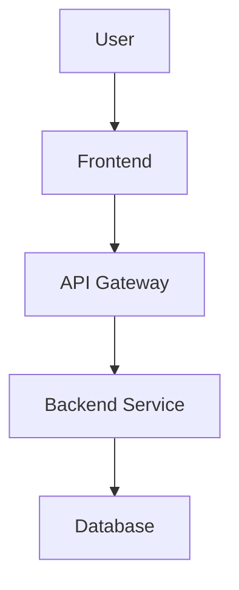
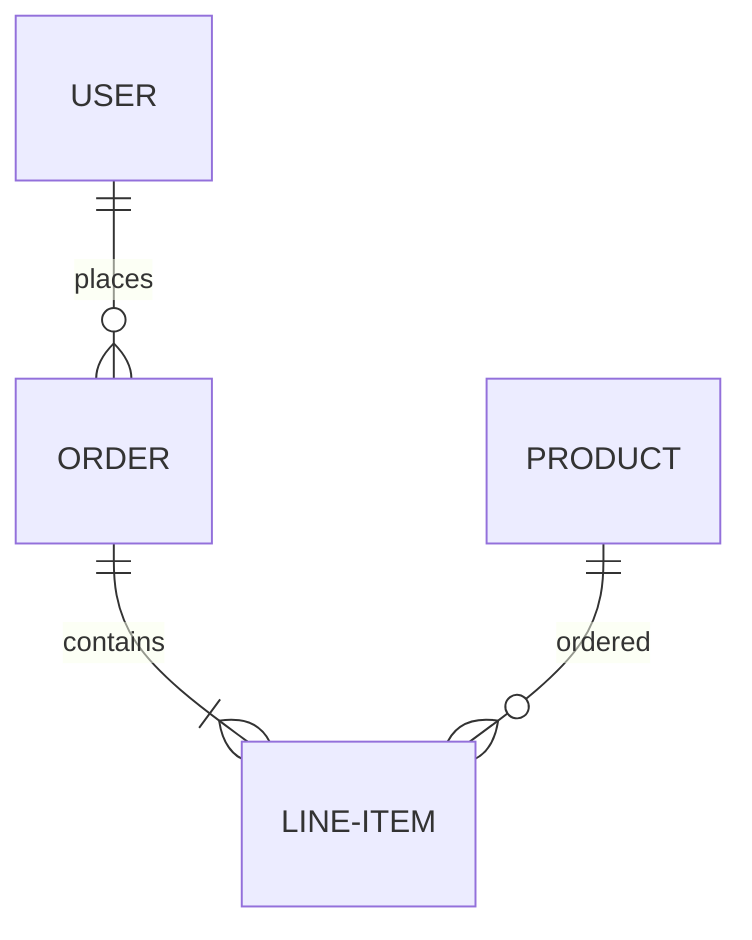

# Technical Specification: AI Workflow Template User Management Architecture

## Metadata

- **Issue**: [#1 - AI Workflow Template User Management](https://github.com/stillrivercode/stillriver-ai-workflows/issues/1)
- **Created**: 2025-06-30
- **Document Type**: Technical Specification
- **Status**: Draft

## Table of Contents

- [Overview](#overview)
- [System Architecture](#system-architecture)
- [Detailed Design](#detailed-design)
- [API Specifications](#api-specifications)
- [Database Design](#database-design)
- [Security Considerations](#security-considerations)
- [Performance Requirements](#performance-requirements)
- [Testing Strategy](#testing-strategy)
- [Deployment Plan](#deployment-plan)
- [Monitoring & Observability](#monitoring---observability)
- [Related Documents](#related-documents)
- [Issue Reference](#issue-reference)

## Overview

### Problem Statement

Technical specification for implementing user authentication and authorization in the AI workflow template, including OAuth integration, role-based access control, and security best practices.

### Solution Summary

[Provide a high-level summary of the proposed technical solution]

### Goals and Objectives

- **Primary Goal**: [Main technical objective]
- **Secondary Goals**: [Additional objectives]
- **Success Criteria**: [How technical success will be measured]

### Assumptions and Constraints

- **Assumptions**: [List key technical assumptions]
- **Constraints**: [Technical, business, or resource constraints]
- **Dependencies**: [External dependencies and integrations]

## System Architecture

### High-Level Architecture



### Component Overview

| Component | Responsibility | Technology |
|-----------|---------------|------------|
| Frontend | User interface | [Technology] |
| Backend | Business logic | [Technology] |
| Database | Data persistence | [Technology] |

### Data Flow

1. [Step 1 description]
2. [Step 2 description]
3. [Step 3 description]

## Detailed Design

### Core Components

#### Component 1: [Name]

**Purpose**: [Component purpose]

**Responsibilities**:
- [Responsibility 1]
- [Responsibility 2]

**Interfaces**:
- [Interface 1]
- [Interface 2]

#### Component 2: [Name]

**Purpose**: [Component purpose]

**Responsibilities**:
- [Responsibility 1]
- [Responsibility 2]

### Algorithms and Logic

#### Algorithm 1: [Name]

```pseudo
function algorithmName(input):
    // Algorithm description
    return result
```

### Error Handling

- **Error Type 1**: [Handling strategy]
- **Error Type 2**: [Handling strategy]

## API Specifications

### REST Endpoints

#### GET /api/resource

**Description**: [Endpoint description]

**Parameters**:
- `param1` (string, required): [Description]
- `param2` (integer, optional): [Description]

**Response**:
```json
{
  "status": "success",
  "data": {
    "example": "response"
  }
}
```

**Error Responses**:
- `400`: Bad Request
- `404`: Resource Not Found
- `500`: Internal Server Error

#### POST /api/resource

**Description**: [Endpoint description]

**Request Body**:
```json
{
  "field1": "value1",
  "field2": "value2"
}
```

**Response**:
```json
{
  "status": "success",
  "data": {
    "id": 123,
    "created_at": "2024-01-01T00:00:00Z"
  }
}
```

### GraphQL Schema (if applicable)

```graphql
type Resource {
  id: ID!
  name: String!
  createdAt: DateTime!
}

type Query {
  getResource(id: ID!): Resource
}

type Mutation {
  createResource(input: ResourceInput!): Resource
}
```

## Database Design

### Entity Relationship Diagram



### Table Schemas

#### users

| Column | Type | Constraints | Description |
|--------|------|-------------|-------------|
| id | UUID | PRIMARY KEY | User identifier |
| email | VARCHAR(255) | UNIQUE, NOT NULL | User email |
| created_at | TIMESTAMP | NOT NULL | Creation timestamp |

#### products

| Column | Type | Constraints | Description |
|--------|------|-------------|-------------|
| id | UUID | PRIMARY KEY | Product identifier |
| name | VARCHAR(255) | NOT NULL | Product name |
| price | DECIMAL(10,2) | NOT NULL | Product price |

### Indexes

- `idx_users_email` on `users(email)`
- `idx_products_name` on `products(name)`

### Migrations

#### Migration 001: Create initial tables

```sql
CREATE TABLE users (
  id UUID PRIMARY KEY DEFAULT gen_random_uuid(),
  email VARCHAR(255) UNIQUE NOT NULL,
  created_at TIMESTAMP NOT NULL DEFAULT now()
);
```

## Security Considerations

### Authentication & Authorization

- **Authentication Method**: [JWT, OAuth2, etc.]
- **Authorization Model**: [RBAC, ABAC, etc.]
- **Token Management**: [Token lifecycle, refresh strategy]

### Data Protection

- **Encryption at Rest**: [Encryption strategy]
- **Encryption in Transit**: [TLS configuration]
- **Sensitive Data Handling**: [PII, secrets management]

### Security Controls

- **Input Validation**: [Validation strategy]
- **Output Encoding**: [XSS prevention]
- **SQL Injection Prevention**: [Parameterized queries, ORM]
- **CSRF Protection**: [CSRF token strategy]

### Compliance Requirements

- **GDPR**: [Data protection measures]
- **SOC2**: [Security controls]
- **PCI DSS**: [Payment card security - if applicable]

## Performance Requirements

### Performance Targets

| Metric | Target | Measurement Method |
|--------|--------|--------------------|
| Response Time | < 200ms | API response time |
| Throughput | 1000 req/sec | Load testing |
| Availability | 99.9% | Uptime monitoring |

### Scalability Considerations

- **Horizontal Scaling**: [Auto-scaling strategy]
- **Database Scaling**: [Read replicas, sharding]
- **Caching Strategy**: [Redis, CDN, application cache]

### Optimization Strategies

- **Database Optimization**: [Query optimization, indexing]
- **Application Optimization**: [Connection pooling, async processing]
- **Infrastructure Optimization**: [Load balancing, CDN]

## Testing Strategy

### Unit Testing

- **Framework**: [Testing framework]
- **Coverage Target**: 80%+
- **Test Categories**: [Business logic, data access, utilities]

### Integration Testing

- **API Testing**: [REST/GraphQL endpoint testing]
- **Database Testing**: [Database integration tests]
- **External Service Testing**: [Mocked external dependencies]

### End-to-End Testing

- **User Journey Testing**: [Critical user paths]
- **Browser Testing**: [Cross-browser compatibility]
- **Mobile Testing**: [Responsive design testing]

### Performance Testing

- **Load Testing**: [Normal load scenarios]
- **Stress Testing**: [Peak load scenarios]
- **Endurance Testing**: [Long-running scenarios]

## Deployment Plan

### Deployment Strategy

- **Strategy Type**: [Blue-green, rolling, canary]
- **Rollback Plan**: [Rollback procedures]
- **Health Checks**: [Application health monitoring]

### Environments

| Environment | Purpose | Configuration |
|-------------|---------|---------------|
| Development | Development work | [Config details] |
| Staging | Pre-production testing | [Config details] |
| Production | Live system | [Config details] |

### Infrastructure Requirements

- **Compute**: [CPU, memory requirements]
- **Storage**: [Database, file storage needs]
- **Network**: [Bandwidth, security groups]

## Monitoring & Observability

### Metrics

- **Application Metrics**: [Response time, error rate, throughput]
- **Business Metrics**: [User activity, feature usage]
- **Infrastructure Metrics**: [CPU, memory, disk usage]

### Logging

- **Log Levels**: [DEBUG, INFO, WARN, ERROR]
- **Log Format**: [Structured logging format]
- **Log Retention**: [Retention policy]

### Alerting

- **Critical Alerts**: [System down, high error rate]
- **Warning Alerts**: [Performance degradation]
- **Notification Channels**: [Email, Slack, PagerDuty]

### Dashboards

- **Operational Dashboard**: [System health overview]
- **Business Dashboard**: [Key business metrics]
- **Debug Dashboard**: [Troubleshooting tools]

## Related Documents

### User Stories

- [User Story for Issue #1](../user-stories/issue-1-ai-workflow-template-user-management.md)

### Architecture Documents

- [System Architecture Overview](../docs/architecture.md)
- [API Design Guidelines](../docs/api-guidelines.md)

### Operational Documents

- [Deployment Guide](../docs/deployment.md)
- [Monitoring Guide](../docs/monitoring.md)

## Issue Reference

**GitHub Issue**: [#1 - AI Workflow Template User Management](https://github.com/stillrivercode/stillriver-ai-workflows/issues/1)

### Original Description

Technical specification for implementing user authentication and authorization in the AI workflow template, including OAuth integration, role-based access control, and security best practices.

### Labels

- `technical-spec`
- `enhancement`
- `technical-spec`
- `documentation`
- `ai-task`

### Workflow Integration

- ✅ **AI Task**: This issue will trigger automated AI implementation
- 📊 **Monitoring**: Track progress in GitHub Actions tab
- 🔄 **Automation**: PR will be created automatically when implementation is complete

---

**Generated**: 2025-06-30
**Tool**: create-spec
**Repository**: stillrivercode/stillriver-ai-workflows
**Workflow**: Unified Issue & Documentation Creation
